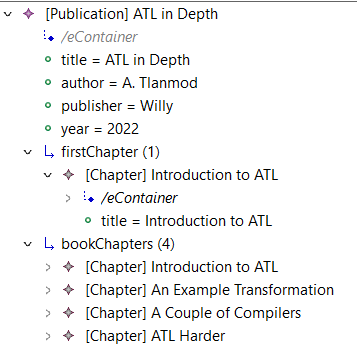

### Book_Publication View

This is a adapted view from the central example in the [EMF Views manual](https://www.atlanmod.org/emfviews/manual/user.html).

Essentially, it creates a unified view for a Publication model aggregating information for a Book model where they share the same title.
It was adapted from the manual since it includes two Virtual Relations in the same View where they are split in the original definition.

Below is a screenshot of the final View in the MoDisco browser.

View description (extracted from the User's manual):

> The Book metamodel has details about each chapter, while the Publication has more information about the publisher and publishing date. This is a simple example of two metamodels with overlapping and complementary information. The view we will create will bring all this information under a single (virtual) metamodel.