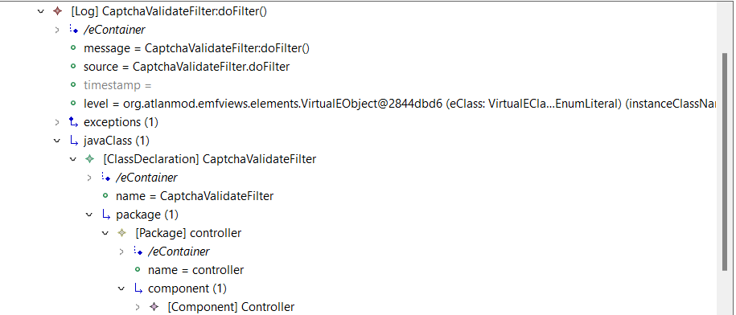

### Traceability View

This is a adapted view from the report example in the [EMF Views manual](https://www.atlanmod.org/emfviews/manual/user.html#creating-an-html-report-from-a-view).

It is used to show a chain among 3 different models related with the same software system.
The 3 models are a ReqIF model for the requirements, a Log model for the logs and finally a Java model represents the PetStore app developed in Java.

Below is a screenshot of the final View in the MoDisco browser.

OBS: The Java model is not included in the repository because of the file size, but it can be downloaded at the main EMF Views repository.