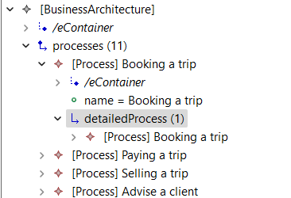

### EA_Application View

This is a adapted view from the the first EMF paper[1].

It is used to show a combination of 3 different models that was created around the same application (Trip planning app).
The 3 models are a TOGAF model from the Enterprise Application, a ReqIF model for the requirements and a BPMN model that shows a simple booking proccess.

This is an adapted version, since the one presented ion the paper used a old version of the tool.

Below is a screenshot of the final View in the MoDisco browser.

The following video shows the view creation in the old version

[1] H. Bruneliere, J. G. Perez, M. Wimmer, and J. Cabot, EMF Views: A View Mechanism for Integrating Heterogeneous Models,� presented at the 34th International Conference on Conceptual Modeling (ER 2015), Oct. 2015. doi: 10.1007/978-3-319-25264-3_23.
