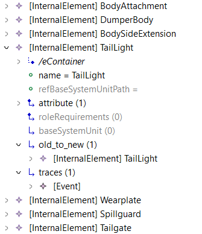

### Evolution View

This is a adapted view from the the VCE paper[2].

This view shows how to use EMF Views to follow the evolution of a engineering system. It shows to different versions of the same system modeled using CAEX.
Based on the changes performed in the models and in the captured Traces for these changes, a View was developed to show a combined model with everything together in the same visualization.

Below is a screenshot of the final View in the MoDisco browser.

[2] Not published yet
